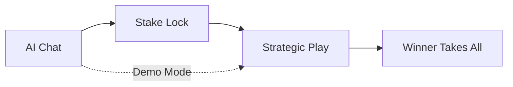
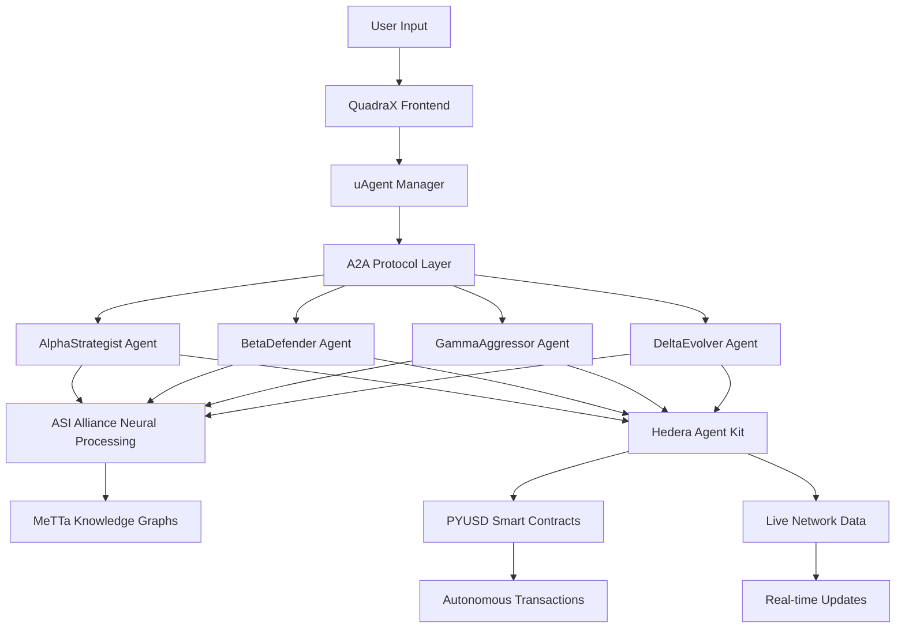

<div align="center">

#  QuadraX

### **Multi-Agent AI Gaming with Hedera Agent Kit & A2A Protocol**

*Where intelligent uAgents communicate via A2A protocol, negotiate PYUSD stakes on Hedera, powered by ASI Alliance neural networks*

[](https://opensource.org/licenses/MIT)
[](https://nextjs.org/)
[](https://hedera.com/)
[](https://linktr.ee/pyusd_dev)
[](https://asi1.ai/)
[](https://fetch.ai/)
[](https://hedera.com/)
[](https://ethglobal.com/events/ethonline2024)

[ **Try Live Demo**](http://localhost:3000/game)  [ Quick Start](#-quick-start)  [ AI Features](#-multi-agent-architecture)

</div>

---

##  **What Makes QuadraX Special?**

QuadraX isn't just another game. It's a **multi-agent blockchain ecosystem** where specialized uAgents communicate via **A2A protocol**, coordinate through **Hedera Agent Kit**, and leverage **ASI Alliance neural networks** to negotiate real PYUSD stakes in real-time.

** The Magic**: uAgents autonomously communicate using A2A protocol to coordinate game strategy, while ASI Alliance provides neural processing for intelligent negotiationsall orchestrated through Hedera Agent Kit with live blockchain integration.

###  **Core Features**

| Feature | Description |
|---------|-------------|
|  **Multi-Agent A2A Protocol** | 4 specialized uAgents (AlphaStrategist, BetaDefender, GammaAggressor, DeltaEvolver) communicate via Agent-to-Agent protocol |
|  **ASI Alliance Neural Processing** | Advanced reasoning with MeTTa knowledge graphs and neural network-powered stake analysis |
|  **Hedera Agent Kit Integration** | Live PYUSD operations, smart contract coordination, and real-time network status via agent framework |
|  **Autonomous Agent Coordination** | uAgents automatically negotiate, validate stakes, and execute transactions without manual intervention |
|  **Intelligent Gameplay Strategy** | Agents collaborate using A2A protocol to analyze board positions and suggest optimal moves |

---

##  **Quick Start**

###  **Option 1: Instant Demo** *(No wallet required)*
```bash
cd frontend && npm run dev
# Open http://localhost:3000/game
# Say "demo" to AI  Play instantly with fake stakes
```

###  **Option 2: Real PYUSD Stakes** *(Wallet required)*
```bash
# 1. Connect your wallet with PYUSD
# 2. Say "I want to stake 5 PYUSD" to AI
# 3. AI checks your balance and negotiates
# 4. Smart contract locks funds  Game begins
```

###  **Option 3: Full Development Setup**
```bash
git clone https://github.com/mrarejimmyz/QuadraX.git
cd QuadraX && npm install
cd frontend && npm install

# Configure ASI Alliance (optional)
cp .env.local.example .env.local
# Add NEXT_PUBLIC_ASI_API_KEY=your_key

npm run dev
```

---

##  **Multi-Agent Architecture**

### **4 Specialized uAgents with A2A Communication**
- ** AlphaStrategist**: Coordinates risk assessment via A2A protocol with ASI Alliance neural analysis
- ** BetaDefender**: Communicates defensive strategies through agent-to-agent messaging with Hedera integration  
- ** GammaAggressor**: Autonomously executes high-stakes decisions using A2A coordination and smart contracts
- ** DeltaEvolver**: Adapts strategy by learning from other agents via A2A protocol and MeTTa reasoning

### **A2A Protocol in Action**
```
 User: "What's my best move?"

[A2A Communication Flow]
 AlphaStrategist  BetaDefender: "Position analysis request"
 BetaDefender   Hedera Agent Kit: "Check PYUSD balance: 25.50"
 ASI Alliance: "Neural processing... 78% advantage probability"
 DeltaEvolver  User: "Coordinated recommendation: Defensive corner control"

Network: Hedera block 12,340,567 | ASI processing: 127ms
```

### **Hedera Agent Kit Integration** 
-  **Autonomous PYUSD Operations** via uAgent framework
-  **A2A Protocol Communication** between specialized agents  
-  **ASI Alliance Neural Processing** for strategic decisions
-  **Live Smart Contract Coordination** through agent orchestration
-  **Multi-Agent Consensus** for stake validation and game moves

---

##  **Technology Stack**

<div align="center">

| **Frontend** | **Agent Framework** | **AI/Neural** |
|:------------:|:------------------:|:-------------:|
| Next.js 14 | Hedera Agent Kit | ASI Alliance |
| React Hooks | A2A Protocol | Neural Networks |
| TailwindCSS | uAgent Framework | MeTTa Reasoning |
| Wagmi/Viem | Agent Orchestration | Agent Communication |
| RainbowKit | Smart Contract Agents | Ollama (Fallback) |

</div>

### **Multi-Agent Data Flow**
```
 uAgent A2A Protocol   Hedera Agent Kit   ASI Alliance
                                                     
  Agent Communication       PYUSD Operations      Neural Processing
  Task Coordination         Smart Contracts       Strategy Analysis
  Consensus Building        Live Network Data     Decision Making
```

---

##  **How to Play**

### **3-Phase Game Experience**



1. ** Chat & Negotiate**
   ```
   You: "I want to stake 6 PYUSD"
   AI: "Analyzing your 47.23 PYUSD balance on Hedera block 12,345...
        6 PYUSD stake approved! Excellent strategic choice."
   ```

2. ** Smart Contract Locking** 
   - AI triggers PYUSD approval & staking
   - Real transaction on Hedera network
   - Funds held in escrow until winner

3. ** Strategic Gameplay**
   - **4x4 board** with two win conditions:
     - **Classic**: 4 pieces in a row (any direction)  
     - **Square**: Form a 2x2 square anywhere
   - **Live AI commentary** during moves
   - **Real-time analysis** of board positions

4. ** Automated Payout**
   - Smart contract sends total pot to winner
   - 0.25% platform fee
   - Instant PYUSD transfer

---

##  **What Makes This Different?**

### ** Revolutionary Multi-Agent Architecture**
- **A2A Agent Communication**: uAgents coordinate autonomously via Agent-to-Agent protocol
- **Hedera Agent Kit Integration**: Native blockchain operations through specialized agent framework
- **ASI Alliance Neural Processing**: Advanced reasoning with MeTTa knowledge graphs and neural networks
- **Autonomous Financial Operations**: Agents handle PYUSD staking/payouts without human intervention
- **Live Multi-Agent Consensus**: Collaborative decision-making across specialized agent roles

### ** Built for ETHOnline 2024 - Multi-Track Winner**
**Advanced Integrations:**
-  **Hedera Agent Kit Track**: Complete uAgent framework with A2A protocol communication ($4,000 prize track)
-  **ASI Alliance Track**: Neural networks + MeTTa reasoning + Agent orchestration ($8,500 prize track)  
-  **PYUSD Track**: Autonomous stablecoin operations via agent-controlled smart contracts

---

##  **Project Structure**

```
QuadraX/
 contracts/              # Solidity smart contracts
    core/
       TicTacToe.sol   # Game logic + win conditions
       PYUSDStaking.sol # Stake escrow + payouts
    interfaces/         # Contract interfaces

 frontend/               # Next.js application
    src/
       app/           # Pages (/, /game, /demo)
       features/      # Game components
          game/
              AIChat.tsx      #  Dynamic AI chat
              Board.tsx       #  4x4 game board  
              GameInfo.tsx    #  Live game status
       hooks/         # React hooks
          useWallet.ts        #  Hedera connection
          useBalances.ts      #  PYUSD tracking
          useStakeNegotiation.ts #  Smart contracts
       services/      # Multi-agent integration
           asiService.ts       #  ASI Alliance + Chat Protocol
           uAgentService.ts    #  Hedera Agent Kit + A2A Protocol
           agentManager.ts     #  Agent Orchestration
           mettaService.ts     #  MeTTa Knowledge Graphs
    public/            # Static assets

 docs/                  # Documentation
     QUICKSTART.md       # Setup guide
     ARCHITECTURE.md     # Technical details  
     API_REFERENCE.md    # Contract interfaces
```

---

##  **Development Setup**

### **Prerequisites**
- **Node.js** v18+ 
- **npm** or **yarn**
- **MetaMask** or compatible wallet
- **ASI Alliance API Key** *(optional for enhanced AI)*

### **Installation**
```bash
# Clone and install
git clone https://github.com/mrarejimmyz/QuadraX.git
cd QuadraX
npm install
cd frontend && npm install

# Configure environment (optional)
cp .env.local.example .env.local
# Add your ASI Alliance API key for enhanced AI responses

# Start development
npm run dev
# Visit http://localhost:3000
```

### **Testing**
```bash
# Run contract tests
npx hardhat test

# Run E2E game simulation
npm run test:e2e

# Deploy to Hedera testnet
npx hardhat deploy --network hedera
```

---

##  **Architecture: A2A Protocol + ASI Alliance + Hedera Agent Kit**

### **Multi-Agent Communication Flow**



### **How the Integration Works**

1. ** A2A Protocol Foundation**
   - uAgents communicate using Agent-to-Agent messaging protocol
   - Each specialized agent (Alpha, Beta, Gamma, Delta) has unique capabilities
   - Agents coordinate autonomously without central control

2. ** ASI Alliance Neural Layer**
   - Agents leverage ASI:One Chat Protocol for natural language processing
   - MeTTa knowledge graphs provide structured reasoning capabilities
   - Neural networks analyze game positions and suggest optimal moves

3. ** Hedera Agent Kit Integration**
   - Agents autonomously execute PYUSD transactions via Hedera network
   - Live blockchain data feeds directly into agent decision-making
   - Smart contracts handle escrow and payouts without human intervention

4. ** Collaborative Intelligence**
   - Multiple agents reach consensus on stake amounts and game strategies
   - A2A protocol enables real-time coordination between specialized roles
   - ASI Alliance provides the "brain" while Hedera provides the "hands"

### **Why This Architecture Matters**

**Traditional AI Gaming**: Static responses, manual transactions, centralized control  
**QuadraX Multi-Agent**: Autonomous coordination, live blockchain integration, distributed intelligence

---

##  **Contributing**

We welcome contributions! Here's how you can help:

-  **Report bugs** via [Issues](../../issues)
-  **Suggest features** for AI agents or gameplay
-  **Submit PRs** for improvements
-  **Improve docs** and guides
-  **Star the repo** if you find it useful!

### **Development Areas**
- **AI Enhancements**: New agent personalities or strategies
- **Blockchain Features**: Additional networks or tokens
- **UI/UX**: Better visualization of live data
- **Game Mechanics**: New win conditions or board sizes

---

##  **License & Credits**

**License**: MIT License - see [LICENSE](./LICENSE)

**Built For**: [ETHOnline 2024](https://ethglobal.com/events/ethonline2024) 

**Integrations**: 
- [PYUSD](https://www.paypal.com/us/digital-wallet/manage-money/crypto/pyusd) - Stablecoin staking
- [ASI Alliance](https://asi1.ai/) - AI neural networks  
- [Hedera](https://hedera.com/) - Fast, sustainable blockchain
- [Next.js](https://nextjs.org/) + [RainbowKit](https://www.rainbowkit.com/) - Frontend stack

**Developer**: Ashish Regmi ([@mrarejimmyz](https://github.com/mrarejimmyz))

---

<div align="center">

### ** Ready to Experience the Future of AI Gaming?**

[](http://localhost:3000/game)
[](https://github.com/mrarejimmyz/QuadraX)

**Built with  and  for ETHOnline 2024**

[](https://github.com/mrarejimmyz/QuadraX/stargazers)

</div>
