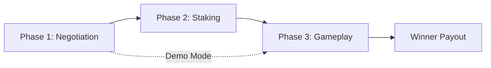

<div align="center">

# 🎮 QuadraX

### AI-Powered 4x4 Tic-Tac-Toe with Real Stakes

*A blockchain-powered strategic game where humans and AI agents negotiate stakes, play for PYUSD, and compete for prize pools*

[](https://opensource.org/licenses/MIT)
[](https://nextjs.org/)
[](https://hardhat.org/)
[](https://soliditylang.org/)
[](https://ethglobal.com/events/ethonline2024)

[🚀 Live Demo](#) • [📖 Documentation](./docs/) • [🎥 Video Demo](#) • [🐛 Report Bug](https://github.com/mrarejimmyz/QuadraX/issues)

</div>

---

## ✨ What is QuadraX?

QuadraX revolutionizes classic Tic-Tac-Toe by combining strategic gameplay with blockchain technology and AI-powered negotiation. Players don't just compete on a 4x4 board—they negotiate stakes with AI agents before the game, lock their PYUSD tokens into smart contracts, and compete for the prize pool.

### 🎯 Key Features


## � Quick Demo

## 🚀 Quick Demo

```bash
# 1. Start Ollama AI (for negotiation)
ollama serve
ollama pull llama3.2:latest

# 2. Start development server
npm run dev

# 3. Open browser and navigate to game
http://localhost:3000/game

# 4. Chat with AI: "Let's play for 6 PYUSD" or say "demo" for free play
```

## 🏗️ How It Works

### 3-Phase Game Flow



1. **🗣️ Phase 1: AI Negotiation**
   - Chat with AI agent to negotiate stakes (1-10 PYUSD range)
   - Say "demo" to skip staking and play for free
   - AI validates stakes and confirms agreement

2. **💰 Phase 2: Staking** *(skipped in demo mode)*
   - Both players approve and lock PYUSD tokens
   - Smart contract holds funds in escrow
   - Total pot displayed with winner's payout calculation

3. **🎮 Phase 3: Gameplay**
   - Play on 4×4 board (X and O alternate)
   - Win by getting 4 in a row or forming a 2×2 square
   - AI provides live commentary and strategic insights

4. **🏆 Winner Payout**
   - Smart contract automatically transfers pot to winner
   - 0.25% platform fee deducted
   - Option to play again

## 🛠️ Technology Stack

<table>
<tr>
<td width="50%">

### Frontend
- **Framework**: Next.js 14 (App Router)
- **Web3**: Wagmi, Viem, RainbowKit
- **Styling**: TailwindCSS, DaisyUI
- **AI Integration**: Ollama (llama3.2:latest)
- **State Management**: React Hooks

</td>
<td width="50%">

### Backend
- **Smart Contracts**: Solidity 0.8.20
- **Development**: Hardhat
- **Blockchain**: Hedera EVM (Testnet)
- **Token**: PYUSD (ERC-20)
- **Testing**: Hardhat, Mocha

</td>
</tr>
</table>

### Architecture Overview

```
┌─────────────────────────────────────────────────┐
│  Frontend (Next.js + RainbowKit)                │
│  • AI Chat (Ollama Integration)                 │
│  • Game Board Component                         │
│  • Wallet Connection (RainbowKit)               │
└──────────────────┬──────────────────────────────┘
                   │ Wagmi Hooks
                   ↓
┌─────────────────────────────────────────────────┐
│  Smart Contracts (Hedera EVM)                   │
│  • PYUSDStaking.sol (escrow & payout)           │
│  • TicTacToe.sol (game logic)                   │
└──────────────────┬──────────────────────────────┘
                   │
                   ↓
┌─────────────────────────────────────────────────┐
│  PYUSD Token (ERC-20)                           │
│  • Stake approval & transfer                    │
│  • Automatic winner payout                      │
└─────────────────────────────────────────────────┘
```

## 🗂️ Project Structure

```
QuadraX/
├── 📄 README.md                    # You are here
├── 📦 package.json                 # Root dependencies (Hardhat)
│
├── 📁 contracts/                   # Solidity smart contracts
│   ├── core/
│   │   ├── TicTacToe.sol          # Game logic contract
│   │   └── PYUSDStaking.sol       # Staking & payout contract
│   ├── interfaces/                # Contract interfaces
│   ├── libraries/                 # Shared libraries (GameLogic)
│   └── test/                      # Mock contracts for testing
│
├── 📁 frontend/                   # Next.js 14 application
│   ├── src/
│   │   ├── app/                   # Pages (/, /game, /demo)
│   │   │   ├── page.tsx           # Homepage with launch button
│   │   │   └── game/page.tsx      # Main game orchestrator (3-phase flow)
│   │   ├── features/              # Feature modules
│   │   │   └── game/
│   │   │       ├── AIChat.tsx     # AI negotiation component
│   │   │       ├── Board.tsx      # 4×4 game board
│   │   │       └── GameInfo.tsx   # Game status display
│   │   ├── hooks/                 # Custom React hooks
│   │   │   └── useStakeNegotiation.ts  # Contract interaction hook
│   │   ├── lib/                   # Utilities
│   │   └── services/              # AI services (ollamaService.ts)
│   └── public/                    # Static assets
│
├── 📁 scripts/                    # Deployment & utility scripts
│   └── deploy.js                  # Hardhat deployment script
│
├── 📁 test/                       # Contract & E2E tests
│   ├── PYUSDStaking.test.js      # Staking contract tests
│   ├── TicTacToe.test.js         # Game logic tests
│   └── test-complete-game.mjs    # Full E2E CLI simulation
│
└── 📁 docs/                       # Documentation
    ├── QUICKSTART.md              # Getting started guide
    ├── ARCHITECTURE.md            # Technical architecture
    ├── 3-PHASE_INTEGRATION.md     # 3-phase flow details
    ├── E2E_TEST_GUIDE.md          # Testing checklist
    └── OLLAMA_SETUP.md            # AI setup instructions
```

> 📘 **Documentation Index**: See [`docs/`](./docs/) folder for detailed guides

## 🚀 Getting Started

### Prerequisites

Ensure you have the following installed:

- **Node.js** v18+ ([Download](https://nodejs.org/))
- **npm** or **yarn**
- **Git** ([Download](https://git-scm.com/))
- **Ollama** ([Download](https://ollama.ai/)) - For AI negotiation
- **MetaMask** ([Install](https://metamask.io/)) - Web3 wallet (optional for demo mode)

### Installation

```bash
# 1. Clone the repository
git clone https://github.com/mrarejimmyz/QuadraX.git
cd QuadraX

# 2. Install root dependencies (Hardhat)
npm install

# 3. Install frontend dependencies
cd frontend
npm install
cd ..
```

### Configuration

<details>
<summary>🔧 <b>Environment Setup (Click to expand)</b></summary>

#### Root `.env` (for Hardhat)
```bash
cp .env.example .env
```

Edit `.env`:
```env
# Hedera Testnet
HEDERA_ACCOUNT_ID=your_account_id
HEDERA_PRIVATE_KEY=your_private_key

# Etherscan (optional)
ETHERSCAN_API_KEY=your_api_key
```

#### Frontend `.env.local`
```bash
cd frontend
cp .env.local.example .env.local
```

Edit `frontend/.env.local`:
```env
# WalletConnect (required for wallet connection)
NEXT_PUBLIC_WALLETCONNECT_PROJECT_ID=your_project_id

# Contract Addresses (after deployment)
NEXT_PUBLIC_TICTACTOE_ADDRESS=0x...
NEXT_PUBLIC_STAKING_ADDRESS=0x...
NEXT_PUBLIC_PYUSD_ADDRESS=0x...

# Ollama API (default: localhost)
NEXT_PUBLIC_OLLAMA_API_URL=http://localhost:11434
```

> 🔗 Get WalletConnect Project ID: https://cloud.walletconnect.com

</details>

### Running Locally

#### Option 1: Demo Mode (No Blockchain Required)

```bash
# Terminal 1: Start Ollama
ollama serve
ollama pull llama3.2:latest

# Terminal 2: Start frontend
cd frontend
npm run dev
```

Open http://localhost:3000/game and say **"demo"** to play for free!

#### Option 2: Full Stack (With Blockchain)

```bash
# Terminal 1: Start Ollama
ollama serve

# Terminal 2: Start Hardhat node
npx hardhat node

# Terminal 3: Deploy contracts
npx hardhat run scripts/deploy.js --network localhost

# Terminal 4: Start frontend
cd frontend
npm run dev
```

Open http://localhost:3000 and connect your wallet.

### Testing

```bash
# Run smart contract tests
npm test

# Run E2E CLI simulation
node test/test-complete-game.mjs

# Run frontend tests (if available)
cd frontend
npm test
```

> 📖 **Detailed Testing Guide**: See [`docs/E2E_TEST_GUIDE.md`](./docs/E2E_TEST_GUIDE.md)

### Deployment

<details>
<summary>🚢 <b>Deploy to Production (Click to expand)</b></summary>

#### Deploy Contracts to Hedera Testnet

```bash
# Configure .env with Hedera credentials
npx hardhat run scripts/deploy.js --network hedera-testnet
```

#### Deploy Frontend to Vercel

```bash
# Option 1: CLI
cd frontend
vercel

# Option 2: GitHub Integration
# Push to GitHub → Connect repo to Vercel → Auto-deploy
```

Set environment variables in Vercel dashboard:
- `NEXT_PUBLIC_WALLETCONNECT_PROJECT_ID`
- `NEXT_PUBLIC_TICTACTOE_ADDRESS`
- `NEXT_PUBLIC_STAKING_ADDRESS`
- `NEXT_PUBLIC_PYUSD_ADDRESS`

</details>

## 🎮 How to Play

### Step-by-Step Guide

1. **🏠 Launch Game**
   - Open http://localhost:3000
   - Click **"🚀 Launch Game - Negotiate Stakes with AI"**

2. **🤖 Phase 1: Negotiate with AI**
   - Chat appears on the right side
   - Say: *"Let's play for 6 PYUSD"* or *"demo"* for free play
   - AI validates stakes (must be 1-10 PYUSD)
   - Say *"Deal!"* to proceed

3. **💰 Phase 2: Lock Stakes** *(skipped in demo mode)*
   - Confirm stake amount
   - Connect wallet (MetaMask)
   - Approve PYUSD spending
   - Lock funds in escrow contract

4. **🎯 Phase 3: Play the Game**
   - Game board becomes active
   - Click cells to place X or O (alternating)
   - Win by getting:
     - 4 in a row (horizontal/vertical/diagonal)
     - 2×2 square (4 cells forming a square)

5. **🏆 Collect Winnings**
   - Winner automatically receives payout
   - Prize = Total Pot × (1 - 0.25% fee)
   - Click "Play Again" to restart

### AI Commands

| Command | Action |
|---------|--------|
| `demo` or `free` | Skip staking, play demo game |
| `Let's play for X PYUSD` | Negotiate stakes (1-10 range) |
| `deal` or `let's do it` | Lock negotiated stakes |
| `help` | Show available commands |
| `analyze` | Get AI analysis of current board |
| `agents` | List active AI agents |

## 🏗️ Development Roadmap

### ✅ Completed Features

- [x] 4×4 game board with 4 win detection types
- [x] Smart contracts (TicTacToe.sol, PYUSDStaking.sol)
- [x] Next.js 14 frontend with App Router
- [x] AI negotiation with Ollama integration (llama3.2)
- [x] 3-phase flow (Negotiation → Staking → Gameplay)
- [x] Demo mode (free play without stakes)
- [x] Wallet connection (RainbowKit + Wagmi)
- [x] PYUSD staking & payout logic
- [x] Hardhat testing suite
- [x] E2E CLI test simulation

### 🚧 In Progress

- [ ] Hedera testnet deployment
- [ ] PYUSD faucet integration
- [ ] Live demo deployment (Vercel)
- [ ] Video demo production

### 🔮 Future Enhancements

- [ ] Multiplayer matchmaking
- [ ] Tournament mode with prize pools
- [ ] AI vs AI spectator mode
- [ ] Historical game replay
- [ ] Leaderboard & player stats
- [ ] Mobile-responsive design improvements
- [ ] Multi-language AI support

> 💡 Want to contribute? See [`CONTRIBUTING.md`](./CONTRIBUTING.md)

## 📚 Documentation

| Document | Description |
|----------|-------------|
| [`QUICKSTART.md`](./docs/QUICKSTART.md) | Quick setup guide |
| [`ARCHITECTURE.md`](./docs/ARCHITECTURE.md) | Technical architecture details |
| [`3-PHASE_INTEGRATION.md`](./docs/3-PHASE_INTEGRATION.md) | 3-phase flow implementation |
| [`E2E_TEST_GUIDE.md`](./docs/E2E_TEST_GUIDE.md) | Complete testing checklist |
| [`OLLAMA_SETUP.md`](./docs/OLLAMA_SETUP.md) | AI setup instructions |
| [`TESTING.md`](./docs/TESTING.md) | Contract testing guide |

## 🤝 Contributing

We welcome contributions! Please see [`CONTRIBUTING.md`](./CONTRIBUTING.md) for guidelines.

### Ways to Contribute

- 🐛 Report bugs via [Issues](../../issues)
- ✨ Suggest new features
- 🔧 Submit pull requests
- 📖 Improve documentation
- ⭐ Star the repo if you find it useful!

## 📄 License

This project is licensed under the MIT License - see the [`LICENSE`](./LICENSE) file for details.

## 🙏 Acknowledgments

- **[ETHOnline 2024](https://ethglobal.com/events/ethonline2024)** - Hackathon opportunity
- **[PYUSD](https://www.paypal.com/us/digital-wallet/manage-money/crypto/pyusd)** - Stablecoin integration
- **[Hedera](https://hedera.com/)** - Fast, sustainable blockchain
- **[Ollama](https://ollama.ai/)** - Local AI inference
- **[Next.js](https://nextjs.org/)** - React framework
- **[RainbowKit](https://www.rainbowkit.com/)** - Web3 wallet connection
- **AI Assistance** - Built with [Claude](https://claude.ai/) by Anthropic

## 🏆 Built For

<div align="center">

### ETHOnline 2024

**Prize Tracks:**
- 🪙 PYUSD - Staking & Payouts
- 🧠 ASI - AI Reasoning & Negotiation  
- 🌐 Hedera - Smart Contract Deployment

</div>

## 📧 Contact

**Developer**: Ashish Regmi  
**Email**: ashishregmi2017@gmail.com  
**GitHub**: [@mrarejimmyz](https://github.com/mrarejimmyz)

---

<div align="center">

**Built with ❤️ for ETHOnline 2024**

[](https://github.com/mrarejimmyz/QuadraX/stargazers)
[](https://github.com/mrarejimmyz/QuadraX/network/members)
[](https://github.com/mrarejimmyz/QuadraX/watchers)

[⬆ Back to Top](#-quadrax)

</div>
